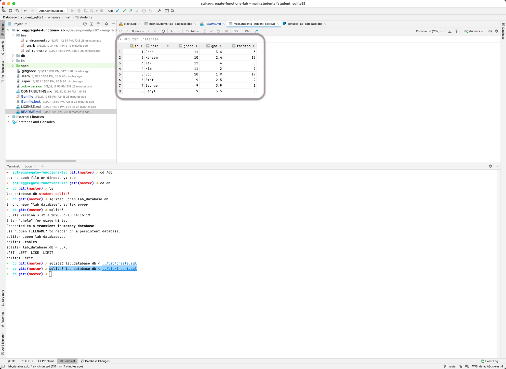

# SQL Aggregate Functions Lab

## Objectives

1. Find the min and max of a number set
2. Count the total of a number set
3. Find the average of a number set

We have a database full of students. The schema is as follows:

Run `learn test` to get started. Write your `SQL` in `lib/students.rb` to get the specs in `spec/student_spec.rb` to pass.

Note: Since it's a Ruby file, write your queries as strings inside each method already defined in `lib/students.rb` .

***** 
### NOTES

Run `sqlite3 lab_database.db < ../lib/create.sql` to create the students table

Run `sqlite3 lab_database.db < ../lib/insert.sql` to insert sample data for the students table

